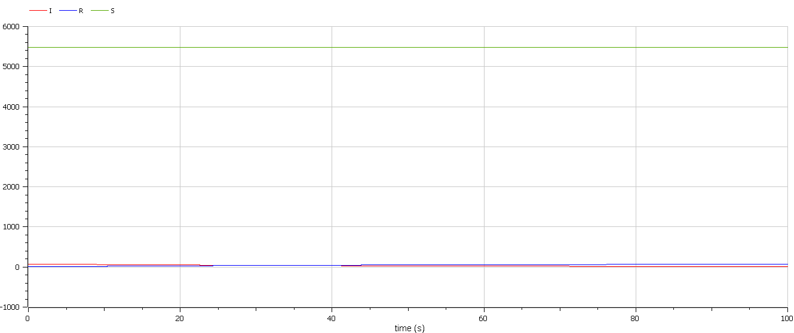
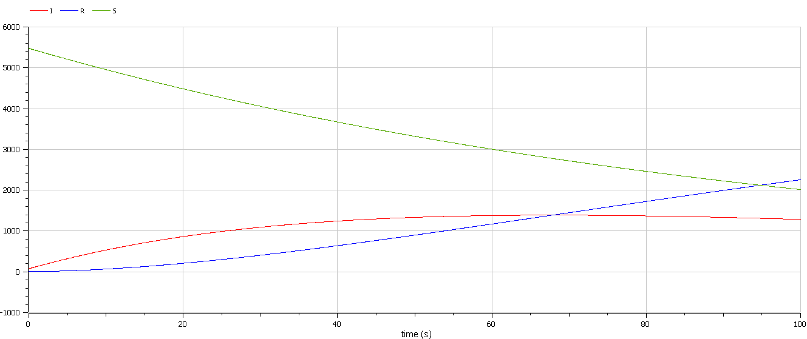

<style>
section::after {
  content: attr(data-marpit-pagination) ' / ' attr(data-marpit-pagination-total);
}
img[alt="center"] {
     display: block;
     margin: 0 auto;
}
h1 {
    font-size: 60px;
    text-align: center;
}
h2 {
    font-size: 30px;
    text-align: left;
    position: relative;
    left: -2em;
    line-height: 0px;
    top: 8em;
}
h3 {
    font-size: 40px;
    text-align: left;
    position: relative;
    left: -0.5em;
    bottom: 0.2em;
}
h4 {
    font-size: 25px;
    text-align: center;
    position: relative;
    left: -0.5em;
    bottom: 0.2em;
}
</style>

# Лабораторная работа №6
## Василий Худицкий 
## РУДН, 2022 Москва, Россия

---

# Прагматика лабораторной работы

- Знакомство с простейшей моделью эпидемии.

- Визуализация результатов моделирования путем построения графиков изменения числа особей.

---

# Цель лабораторной работы

- Научиться строить простейшую модель эпидемии.
- Рассмотреть два случая протекания эпидемии.
- Научиться строить графики изменения числа особей в каждой из трех групп.

---

### Задание лабораторной работы

На одном острове вспыхнула эпидемия. Известно, что из всех проживающих на острове ($N=5555$) в момент начала эпидемии ($t=0$) число заболевших людей (являющихся распространителями инфекции) $I(0)=75$. А число здоровых людей с иммунитетом к болезни $R(0)=4$. Таким образом, число людей восприимчивых к болезни, но пока здоровых, в начальный момент времени $S(0)=N-I(0)- R(0)$. Постройте графики изменения числа особей в каждой из трех групп. Рассмотрите, как будет протекать эпидемия в случае:

1) если $I(0) \leqslant I^*$
2) если $I(0) > I^*$

---

# Результаты выполнения лабораторной работы

---

# Случай 1 (если $I(0) \leqslant I^*$)

```Modelica
 model lab06case1
  constant Real b = 0.02; //коэффициент выздоровления
  constant Real N = 5555; //общее число проживающих на острове
  
  Real R; // здоровые, с иммунитетом
  Real I; // заболевшие
  Real S; // здоровые, в зоне риска
  
 initial equation
  R = 4; // здоровые с иммунитетом в момент начала эпидемии
  I = 75; // заболевшие в момент начала эпидемии
  S = N-I-R; //восприимчивые, но пока здоровые в момент начала эпидемии
 equation
 //Случай 1: I<=I*
  der(S) = 0;
  der(I) = -b*I;
  der(R) = b*I; 
 end lab06case1;

```

---

#### 
##### Рис.1 Графики изменения числа особей в каждой из трех групп для случая 1

---

# Случай 2 (если $I(0) > I^*$)

```Modelica
 model lab06case2
  constant Real a = 0.01; //коэффициент заболеваемости
  constant Real b = 0.02; //коэффициент выздоровления
  constant Real N = 5555; //общее число проживающих на острове
  
  Real R; // здоровые, с иммунитетом
  Real I; // заболевшие
  Real S; // здоровые, в зоне риска
  
 initial equation
  R = 4; // здоровые с иммунитетом в момент начала эпидемии
  I = 75; // заболевшие в момент начала эпидемии
  S = N-I-R; //восприимчивые, но пока здоровые в момент начала эпидемии
 equation
 //Случай 2: I>I*
  der(S)=-a*S "изменение числа восприимчивых к болезни, но пока здоровых";
  der(I)=a*S-b*I "изменение числа инфецированных распространителей";
  der(R)=b*I "изменение числа здоровых с иммунитетом";
 end lab06case2;

```

---

#### 
##### Рис.2 Графики изменения числа особей в каждой из трех групп для случая 2

---

# Выводы
Научился строить
- простейшую модель эпидемии, рассматривая два случая протекания эпидемии,
- графики изменения числа особей в каждой из трех групп для простейшей модели эпидемии.
